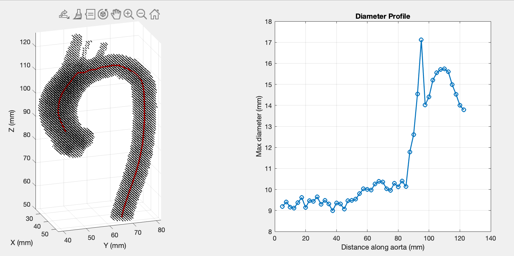

# Aortic Centerline Extraction

## Overview

This MATLAB script automates the extraction of the aortic centerline and computes stepwise maximal diameters along the aortic arch, based on the algorithm described by Bramlet et al. in *Journal of Medical Imaging* 11(3):034503 (2024).

## Reference

> Bramlet, M., Mohamadi, S., Srinivas, J., Dassanayaka, T., Okammor, T., Shadden, M., & Sutton, B. P. (2024). Automating aortic cross-sectional measurement of 3D aorta models. *Journal of Medical Imaging*, 11(3), 034503. DOI: 10.1117/1.JMI.11.3.034503

## Features

* Automatic centerline initialization and tracking from diaphragm to aortic root
* Wobble-based plane angle search to identify minimal cross-sectional areas
* Computation of maximal diameters at each step along the centerline
## Requirements

* MATLAB R2021a or later
* Image Processing Toolbox

## Installation

1. Clone or download this repository:

   ```bash
   git clone https://github.com/username/aortic-centerline.git
   ```
2. Add the script directory to your MATLAB path:

   ```matlab
   addpath(genpath('path/to/aortic-centerline'));
   ```

## Usage

1. Prepare your 3D aorta segmentation as an NIFTI file.
2. Edit the parameters and filepath of the segmentation in the main script.

## Input

* **3D Segmentation**: NIFTI of the thoracic aorta segmentation.
* **Parameters**: Step size, wobble angle maximum, and maximum steps.

## Output

* ```ctr``` stores the points of the calculated centerline
* ```dmd``` stores the diameter measurements flood-filled in each step.

## Examples



## License

This project is distributed under the MIT License.

